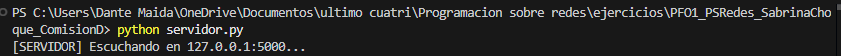
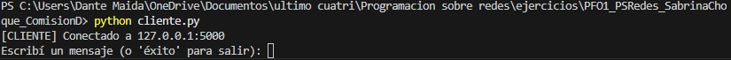
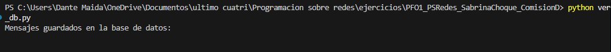
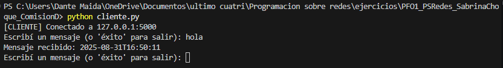
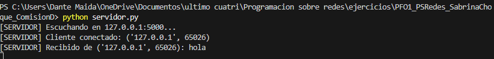
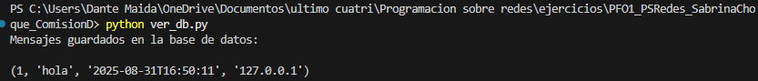
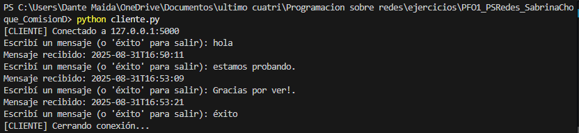
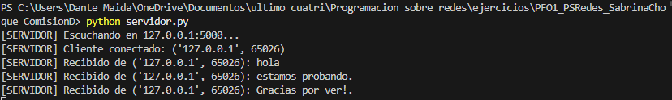
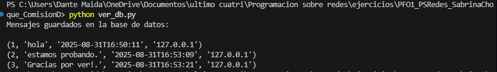
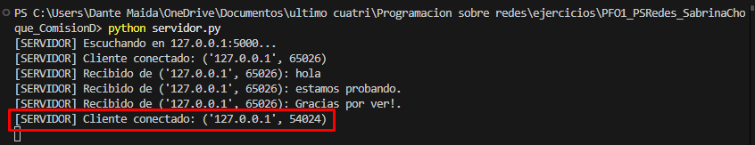

PFO1_PSRedes_SabrinaChoque_ComisionD

Alumno: Sabrina Choque

Comision: D

gitHub: https://github.com/SabrinaChoque/PFO1_PSRedes_SabrinaChoque_ComisionD

Descripcion del PFO1:

El objetivo de este proyecto es crear un sistema simple de comunicación "cliente y servidor". Lo que realizamos es crear archivos servidor, cliente y ver_db. 
Con esto realizaremos la conexión, podremos enviar y recibir mensajes entre servidor y cliente, también se guardará en una base de datos los mensajes y también debemos registrar con fecha, hora e IP.

Los archivos utilizados en Python son:
servidor.py: recibe los mensajes, los guarda en la base de datos y responde al cliente.
cliente.py: se conecta al servidor, envía mensaje y finaliza al escribir la palabra "éxito".
ver_db.py: permite que en pantalla se vean los mensajes guardados como una base de datos.
mensajes.db: este archivo es la base de datos que se genera automáticamente.

Para ejecución y ver debemos realizar los siguientes pasos:
1. Abriremos tres terminales en la carpeta del proyecto.
2. En cada una de las terminales debemos iniciar cada terminal para su respectiva prueba:
En servidor.py :

En cliente.py:

En ver_db.py:

3. Una vez inicializados en cliente.py, escribiremos los mensajes al servidor, este estará a su vez recibiendo desde servidor.py y se mostrará en ver_db.py:
terminal cliente:

terminal servidor:

terminal ver_db:

4. Como vemos en las imágenes, los servidores funcionan. Para finalizar simplemente escribimos "éxito" y saldrá lo siguiente:
cliente :

servidor:

ver_db:

5. Cuando queramos volver a abrir el servidor solo ingresamos de nuevo en cliente con "python cliente.py", y en servidor nos brindará un nuevo cliente conectado:

Con este trabajo práctico entendimos cómo funciona la comunicación cliente-servidor con sockets en Python y cómo se pueden guardar los mensajes en una base de datos para consultarlos después.